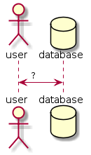
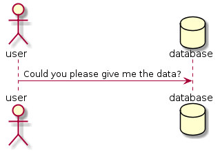
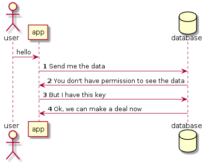
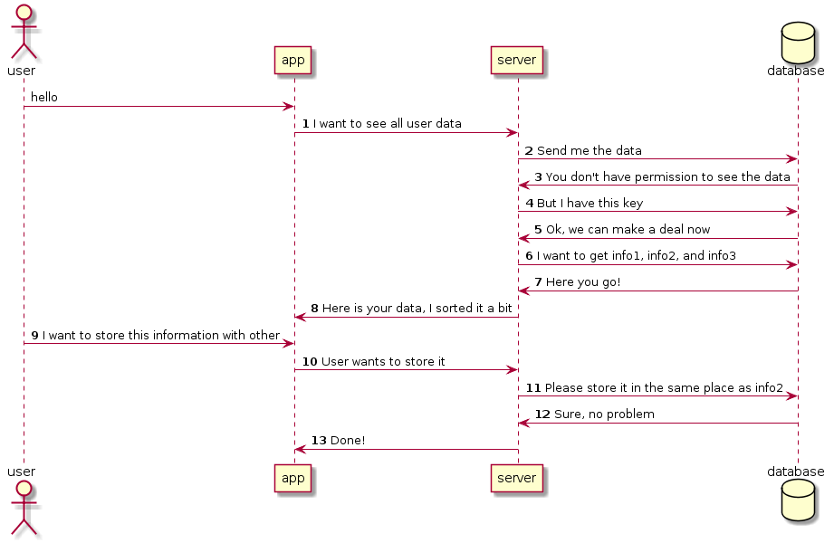
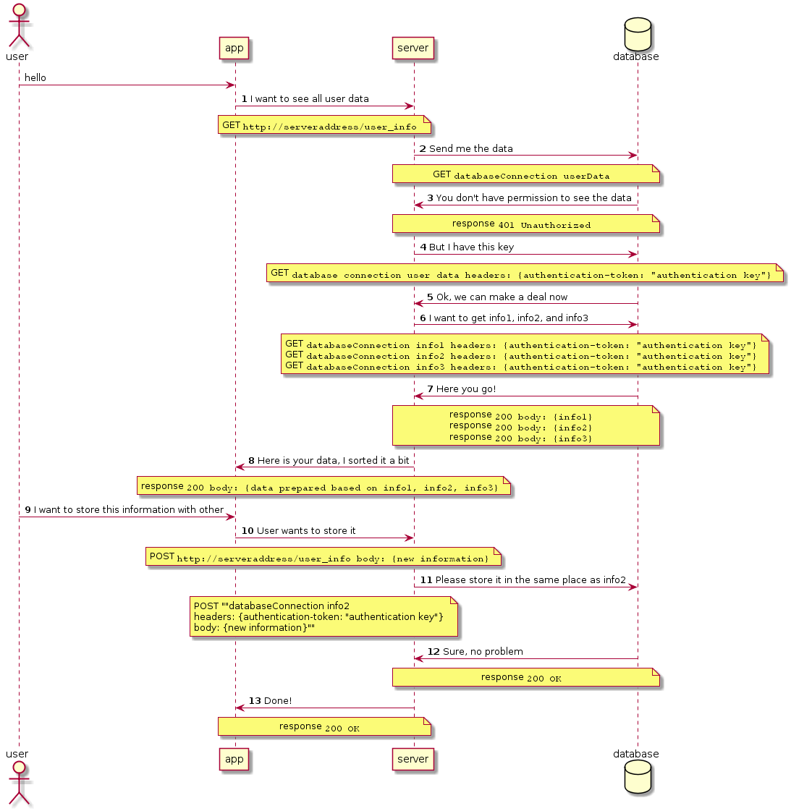

# Fitting the puzzle pieces together

Now that you have a server connected to your database, we have the necessary pieces to power up the Todo List app. We can access todo list items from anywhere by having a centralized storage, the database. But, how do we use the database we created to get the data? 

## The first two puzzle pieces

Our current situation looks like the diagram below. We want to access the database, but the interaction line between the user (that's us) and the database has a question mark.

Well, you may kindly ask to retrieve it:

## Adding the Todo List app into the puzzle 

Is it that straightforward? It depends on many factors, but by building the Todo List app you've added extra point in this communication chain. We can represent the Todo List app in the interaction sequence.

There are multiple steps needed to communicate to a database, so if we use the app the communicate directly to the database the interaction sequence might look something like this:

## The final piece of the puzzle

But as we learned in an earlier section, web applications communicate to the database through a middle-woman service so that the app doesn't have to handle complex data interactions.

Here's an example of the complex behavior that a server can provide.

Let's pretend you have an app that handles your expenses and budget. One feature of the app is a unified view of the following items:
- budget for this month 
- expenses from this month
- planned expenses like rent money, Internet money, etc

In the database you separated budget data, expense data, and planned expense data into different collections so that each collection holds a distinct information. 

To display all the budget and expense information for the month, you will have to ask for data 3 times, once to get budget, another to get expenses, and lastly to get planned expenses even though in the app this is one unified view. This is where the middle-woman service comes to the rescue! 

Instead of asking for the data 3 times from the app, the service can gather all the information your app needs into 1 call. This is the power of using a server.

## Putting it all together using REST and CRUD calls

Now let's see the same diagram, but add in the **REST** and **CRUD** calls alongside the interactions between user, app, server, and database.

You can see that server is also communicating to the database via HTTP requests. That's because we are using **MongoDB** which has HTTP access to the data. There are other ways for a server to communicate with a database, but to get you understanding of what is happening we decided to show it this way.

So now we will add in the code to communicate to the server into our app! So exciting!

